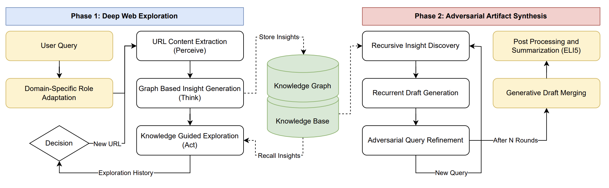

<p align="center">
  
</p>

# Rome

Rome is a Python framework for building intelligent, autonomous AI agents. It provides shared infrastructure — LLM integration, configuration, logging, knowledge base management, and memory — on top of which specialized agent modules are built. It is used to build the following projects below:

## Projects

### [Caesar](caesar/README.md) — Deep Agentic Web Exploration for Creative Answer Synthesis

Current web agents and RAG systems treat the internet as a flat sequence of disconnected documents, optimizing for retrieval precision but overlooking the hidden structure of the information space. This makes them effective summarizers, but poor researchers — they suffer from "navigational amnesia," looping through redundant content and producing derivative outputs that lack the novelty and lateral logic required for genuine insight.

Caesar is an agentic LLM architecture designed to bridge the gap between passive information gathering and creative synthesis of new ideas. It constructs a dynamic knowledge graph during web traversal and uses it as an engine for associative reasoning, automating the combinatorial process that drives creative hypothesis generation — the discovery of non-obvious connections between disparate concepts.

<p align="center">
  
</p>

Caesar operates in two phases:

1. **Deep Web Exploration** — A recursive **Perceive-Think-Act** loop performs stateful graph traversal of the web. The agent fetches and parses content (Perceive), generates context-aware insights conditioned on the local topology of the exploration graph — analyzing how new content builds upon or contradicts neighboring nodes rather than summarizing in isolation (Think), and selects the next action using a dynamic policy informed by both the vector knowledge base and episodic navigation memory, autonomously switching between depth-first expansion, strategic backtracking, and web search to maximize information gain (Act).

2. **Adversarial Artifact Synthesis** — Rather than producing a single-pass summary, Caesar emulates the recursive drafting and critiquing process of a human researcher. It performs recursive insight discovery via iterative Q&A chains against the knowledge base, generates recurrent drafts with source citations, and between rounds formulates adversarial queries explicitly targeting narrative weaknesses and contradictions in the current draft. This forces exploration into directions that maximize information gain relative to the current belief state. Multiple drafts are then consolidated through a generative merge that recovers utility while retaining discovered novelties, with an optional ELI5 post-processing stage for accessibility.

The architecture introduces four technical innovations: **domain-specific role adaptation** (the agent dynamically rewrites its own system prompt to adopt a persona tuned to the domain's creative constraints, overcoming RLHF safety-biased generic responses), **graph-augmented insight generation** (information extraction is conditioned on the exploration graph neighborhood, enabling online associative reasoning that identifies connections and contradictions relative to neighboring nodes), **knowledge-guided exploration** (a dynamic decision-making policy that uses exploration context and episodic memory to detect navigational stagnation and force backtracking), and **adversarial query refinement** (orthogonal queries designed to push the agent out of the local minima of generic LLM consensus).

In evaluations using a blinded LLM-as-a-Judge framework, Caesar significantly outperformed all baselines (Mann-Whitney U, p < 0.001) — including the deep research modes of GPT-5.2, Claude Sonnet 4.5, and Gemini 3 Pro — surpassing the runner-up by a margin of 3+ points and achieving the highest scores across all three creativity dimensions: *New* (novelty/rarity), *Useful* (viability/alignment), and *Surprising* (non-obvious connections). Ablation studies confirm that both deep topological exploration and adversarial draft refinement are independently necessary: shallow retrieval cannot reach the rare, long-tail insights that elevate artifacts beyond surface-level analysis, and single-pass synthesis cannot escape derivative summarization.

**Paper:** [Caesar: Deep Agentic Web Exploration for Creative Answer Synthesis (PDF)](caesar/paper/caesar.pdf)

### [Rome](rome/README.md) — FSM-Based AI Agent Framework

Rome is the core library providing Finite State Machine (FSM) architecture for building AI agents that autonomously analyze, edit, test, and execute code. It includes configurable FSM workflows, multi-agent coordination, smart action selection strategies, and built-in benchmarking against coding datasets like HumanEval+. See the [Rome README](rome/README.md) for full documentation.

## Getting Started

```bash
git clone https://github.com/yourusername/rome.git
cd rome
pip install -e .
```

```bash
export OPENAI_API_KEY=your_api_key_here
```

See individual project READMEs for detailed setup and usage instructions.

## License

See LICENSE file for details.
