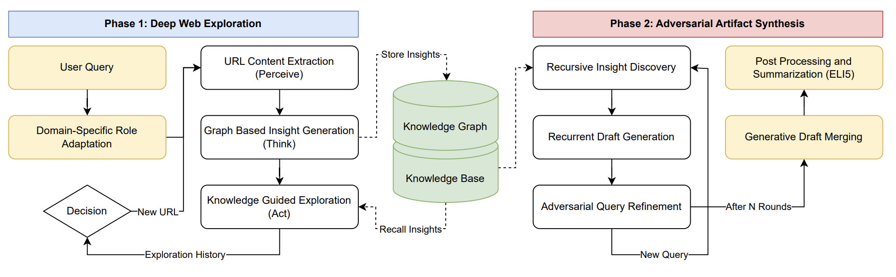

# Caesar: Autonomous Web Exploration Agent

Caesar is an LLM-powered autonomous agent that explores the web to discover, synthesize, and generate novel insights. It uses a **Perceive-Think-Act** loop to navigate web pages, extract knowledge, build a knowledge graph, and produce synthesis artifacts via an adversarial Generator-Verifier loop.

See the [repo root README](../README.md) for benchmark results and project overview. This document covers configuration, usage modes, and advanced options.

## Table of Contents

- [Overview](#overview)
- [Architecture](#architecture)
- [Installation](#installation)
  - [ChromaDB Vector Database](#optional-chromadb-vector-database)
  - [Neo4j Graph Database](#optional-neo4j-graph-database)
  - [Database Configuration](#database-configuration-parameters)
- [Quick Start](#quick-start)
- [Configuration](#configuration)
- [Exploration Modes](#exploration-modes)
- [Synthesis & Artifacts](#synthesis--artifacts)
- [Output Files](#output-files)
- [Example Configs](#example-configs)
- [Advanced Usage](#advanced-usage)
- [Troubleshooting](#troubleshooting)
- [Using Caesar in Your Project Repo](#using-caesar-in-your-project-repo)

## Overview

Caesar operates as an "Insight Hunter" rather than a traditional search engine. Its core philosophy:

- **Break information filter bubbles**: explore beyond obvious results
- **Recursive curiosity**: follow unexpected connections
- **Find novel connections**: discover relationships across domains
- **Stochastic drifting**: embrace controlled randomness in exploration
- **Cross-domain synthesis**: combine insights from disparate sources

### Key Features

- **Autonomous web exploration** with LLM-guided link selection
- **Knowledge graph construction** tracking exploration paths
- **Vector knowledge base** for semantic insight storage and retrieval (ChromaDB + LlamaIndex)
- **Multi-provider LLM support** via litellm: OpenAI, Anthropic, Gemini, or any OpenAI-compatible endpoint
- **Brave Search integration** for web search during exploration
- **Multi-draft artifact synthesis** with adversarial query refinement, citation tracking, and generative draft merging
- **Checkpoint/resume** support for long explorations
- **Configurable role adaptation** based on exploration content
- **Experiment summary JSON** emitted per run (tokens, cost, wall-time, artifact paths)
- **Stealth browsing**: dynamic Referer and Sec-Fetch-Site headers computed per navigation to match real browser behavior

## Architecture

<p align="center">
  
</p>

**Phase 1 (left): Deep Web Exploration.** A dynamic exploration policy controls a three-stage loop (Perceive, Think, Act) to traverse the web and build a knowledge graph + knowledge base from insights.

**Phase 2 (right): Adversarial Artifact Synthesis.** Insights are retrieved to synthesize an initial draft. The agent then enters a recursive cycle, critiquing the current draft to generate adversarial queries for refinement, before consolidating all versions via a generative merge and ELI5 summary.

## Installation

### Prerequisites

- Python 3.10+
- The `rome` parent framework (top-level of this repo)

### Install Dependencies

```bash
cd /path/to/caesar-agent
pip install -e .
```

### Environment Variables

```bash
# At least one LLM provider key (required for your chosen provider)
export OPENAI_API_KEY="your-openai-api-key"
export ANTHROPIC_API_KEY="your-anthropic-api-key"
export GOOGLE_API_KEY="your-google-api-key"

# Required for web search mode
export BRAVE_API_KEY="your-brave-search-api-key"
```

### Optional: Graph Visualization

For exploration graph visualization, install pygraphviz:

```bash
# macOS
brew install graphviz
pip install pygraphviz

# Ubuntu/Debian
sudo apt-get install graphviz graphviz-dev
pip install pygraphviz
```

### Optional: ChromaDB Vector Database

ChromaDB handles semantic storage and retrieval of insights. It runs in embedded mode by default. For shared multi-agent setups, run as a standalone server:

```bash
pip install chromadb
chroma run --host localhost --port 8000
```

### Optional: Neo4j Graph Database

Neo4j is only required if you set `use_graph: true` in config for persistent entity/relationship storage. Most users don't need this.

**macOS:**
```bash
brew install neo4j
brew services start neo4j
```

**Ubuntu/Debian:**
```bash
curl -fsSL https://debian.neo4j.com/neotechnology.gpg.key | sudo gpg --dearmor -o /usr/share/keyrings/neo4j.gpg
echo "deb [signed-by=/usr/share/keyrings/neo4j.gpg] https://debian.neo4j.com stable latest" | sudo tee /etc/apt/sources.list.d/neo4j.list
sudo apt-get update && sudo apt-get install neo4j
sudo systemctl start neo4j
```

After install, the Neo4j web UI is at `http://localhost:7474` (default creds `neo4j`/`neo4j`, will prompt to change).

### Database Configuration Parameters

**Neo4j (Graph Database) — `AgentMemory` section:**
| Parameter | Default | Description |
|---|---|---|
| `use_graph` | false | Enable graph memory (requires Neo4j) |
| `graph_url` | `bolt://localhost:7687` | Neo4j Bolt connection URL |
| `graph_username` | `neo4j` | Neo4j username |
| `graph_password` | `neo4jneo4j` | Neo4j password |

**ChromaDB (Vector Database) — `ChromaClientManager` / `ChromaServerManager` sections:**
| Parameter | Default | Description |
|---|---|---|
| `embedding_model` | `text-embedding-3-small` | OpenAI embedding model |
| `host` | `localhost` | Server bind host (for standalone mode) |
| `port` | 8000 | Server bind port |
| `persist_path` | None | Data persistence directory (auto-set if None) |

## Quick Start

### Basic Usage

Run from the **`caesar/`** directory (config paths are relative to this location):

```bash
cd caesar
python run_agent.py [repository] config [-q QUERY] [--max-iterations N]
```

**Arguments:**
- `repository`: directory to store exploration results (optional, auto-generated under `result/` if omitted)
- `config`: path to YAML config file, or a preset name: `regular`, `mini`, `nano`
- `-q, --query`: override `starting_query` from config
- `--max-iterations`: override `max_iterations` from config

### Example: Quick Test Run

```bash
# Tiny 5-iteration test with Claude Haiku (roughly $0.30, 10 min)
python run_agent.py config/config_test/single_agent_test.yaml

# Or nano preset with a custom query
python run_agent.py nano -q "Novel way to solve ARC-AGI benchmark" --max-iterations 5
```

### Example: Deep Research Run

```bash
# Default preset: 250 iterations, GPT-5.4, ~$5-$10
python run_agent.py regular -q "Cross-domain creativity research"

# Explicit config + output directory
python run_agent.py ./result/creativity config/config_creative/openended_creativity.yaml
```

### Batch Mode

Run multiple experiments in parallel via a JSONL file:

```bash
# Run batch with 4 parallel workers
python run_agent.py -b experiments.jsonl -n 4

# Check experiment status
python run_agent.py -b experiments.jsonl --status

# Stop/restart individual experiments
python run_agent.py -b experiments.jsonl --stop 3
python run_agent.py -b experiments.jsonl --restart 3
```

**JSONL format** (one JSON object per line, `config` is required):

```jsonl
{"config": "nano", "query": "what is photosynthesis", "max_iterations": 50}
{"config": "config/config_creative/openended_creativity.yaml", "query": "emergent behavior", "repository": "result/custom_dir"}
```

Each experiment runs as a separate subprocess. Status is tracked in `<batch>.status.json`. Stopped/failed experiments resume from the last checkpoint on restart.

## Configuration

Configuration files are YAML documents that override default settings. Only specify settings that differ from defaults.

### Configuration Structure

```yaml
Agent:
  name: CaesarExplorer

CaesarAgent:
  starting_url: "https://example.com"     # OR
  starting_query: "Your search query"     # (mutually exclusive)
  max_iterations: 100
  max_depth: 1000
  # ... more settings

ArtifactSynthesizer:
  synthesis_iterations: 20
  synthesis_drafts: 3
  # ... more settings

LLMHandler:
  provider: openai                  # or "anthropic", "gemini"
  model: gpt-5.4
  cost_limit: 50.0
  temperature: 0.1

AgentMemory:
  enabled: true
  use_graph: false

Logger:
  level: info
```

For full configs used in published experiments, see YAMLs under `config/config_creative/`.

### Key Configuration Parameters

#### CaesarAgent Settings

| Parameter | Default | Description |
|---|---|---|
| `starting_url` | None | Initial URL to begin exploration |
| `starting_query` | None | Initial search query (alternative to URL) |
| `additional_starting_queries` | 5 | Generate N related queries from initial query |
| `max_iterations` | 1000 | Total pages to explore |
| `max_depth` | 1000 | Max tree depth before forced backtrack |
| `max_web_searches` | 0 | Web searches allowed during exploration |
| `allowed_domains` | `[]` | Domain whitelist; empty = starting domain only; `["*"]` = all |
| `max_allowed_revisits` | 20 | Max times to revisit same page |
| `checkpoint_interval` | 1 | Save checkpoint every N iterations |
| `save_graph_interval` | 1 | Save graph snapshot every N iterations |
| `draw_graph` | false | Generate PNG graph visualizations (requires pygraphviz) |
| `adapt_role` | false | Dynamically adapt agent role based on content |
| `overwrite_role_file` | None | Path to custom role definition (overrides default system prompt) |
| `use_quick_explore` | false | Parallel single-hop mode (see [Exploration Modes](#exploration-modes)) |
| `quick_explore_workers` | 20 | Worker threads for quick-explore mode |
| `exploration_llm_config.model` | `gpt-5.2` | Model for exploration decisions (Perceive/Think/Act) |
| `exploration_llm_config.temperature` | 0.9 | Exploration temperature (higher = more creative) |
| `exploration_llm_config.reasoning_effort` | `low` | For reasoning models |

#### ArtifactSynthesizer Settings

| Parameter | Default | Description |
|---|---|---|
| `synthesis_classic_mode` | false | Ask all queries at once (vs iterative Q&A chain) |
| `synthesis_drafts` | 3 | Number of synthesis drafts |
| `synthesis_iterations` | 20 | Q&A iterations per draft |
| `synthesis_top_k` | 50 | KB retrieval top-k per query |
| `synthesis_top_n` | 10 | Reranker top-n per query (when reranking enabled) |
| `synthesis_prev_artifact` | true | Condition each draft on previous draft |
| `synthesis_max_length` | None | Max words for artifact (None = unlimited) |
| `synthesis_merge_artifacts` | false | Merge multiple drafts into a single final artifact |
| `synthesis_eli5` | false | Generate "Explain Like I'm 5" summary |
| `synthesis_eli5_length` | None | Max words for ELI5 summary |
| `synthesis_iteration_filter` | None | Only use insights from iterations < N |

#### LLMHandler Settings

| Parameter | Default | Description |
|---|---|---|
| `provider` | `openai` | LLM provider: `openai`, `anthropic`, or `gemini` |
| `model` | `gpt-4o` | LLM model for synthesis |
| `cost_limit` | 500.0 | Max API spend in USD before graceful stop |
| `temperature` | 0.1 | Temperature for synthesis (lower = focused) |
| `timeout` | 60 | API timeout in seconds |
| `reasoning_effort` | None | For reasoning models (`low`/`medium`/`high`); None to disable |
| `max_completion_tokens` | 10000 | LLM response max tokens |
| `max_retries` | 10 | Max retries on API failure |

### Multi-Provider LLM Examples

**OpenAI (default):**
```yaml
LLMHandler:
  provider: openai
  model: gpt-5.4
  reasoning_effort: low
```

**Anthropic Claude:**
```yaml
LLMHandler:
  provider: anthropic
  model: claude-haiku-4-5-20251001   # or claude-sonnet-4-5, claude-opus-4-7
  temperature: 0.1
```

**Google Gemini:**
```yaml
LLMHandler:
  provider: gemini
  model: gemini-3-pro-latest
```

## Exploration Modes

### 1. URL-Based Exploration

Start from a specific URL and explore linked pages:

```yaml
CaesarAgent:
  starting_url: "https://en.wikipedia.org/wiki/Artificial_intelligence"
  allowed_domains: []      # Empty = stay on starting domain
```

### 2. Query-Based Exploration (Web Search)

Start from a web search query. Caesar generates additional related queries to broaden the entry point:

```yaml
CaesarAgent:
  starting_query: "Novel approaches to solving ARC-AGI benchmark"
  additional_starting_queries: 5   # Generate 5 related queries
  max_web_searches: 30             # Allow 30 searches during exploration
```

### 3. Domain-Restricted Exploration

Limit exploration to specific domains:

```yaml
CaesarAgent:
  starting_url: "https://arxiv.org/abs/1234.5678"
  allowed_domains: ["arxiv.org", "openreview.net"]
```

### 4. Open Exploration

Allow exploration across any domain:

```yaml
CaesarAgent:
  starting_query: "Cross-domain creativity research"
  allowed_domains: ["*"]
```

### 5. Quick Explore (Parallel Single-Hop)

Fan out to all search-result links in parallel, skipping the navigation policy. Good for breadth-first snapshots; not good for deep topological traversal:

```yaml
CaesarAgent:
  use_quick_explore: true
  quick_explore_workers: 20    # Number of parallel fetch threads
```

## Synthesis & Artifacts

After exploration, Caesar synthesizes collected insights through the adversarial draft-refine-merge loop (Phase 2 of the [paper](paper/caesar.pdf)).

### Synthesis Modes

**Iterative mode** (default): builds understanding progressively through a Q&A chain, with each answer generating the next query:

```yaml
ArtifactSynthesizer:
  synthesis_classic_mode: false
  synthesis_iterations: 25
```

**Classic mode**: asks all queries in a single pass:

```yaml
ArtifactSynthesizer:
  synthesis_classic_mode: true
```

### Multi-Draft Synthesis with Merge

Generate multiple drafts under adversarial query refinement, then merge:

```yaml
ArtifactSynthesizer:
  synthesis_drafts: 3
  synthesis_merge_artifacts: true
  synthesis_eli5: true
  synthesis_eli5_length: 500
```

### Output Format

Each synthesis artifact includes:
- **Abstract**: 80–120 word summary
- **Main content**: synthesized insights with inline citations (`[1]`, `[2]`, ...)
- **Sources**: full citation list with URLs
- **ELI5** (optional): simplified explanation in plain English

## Output Files

All outputs land in the repository directory:

```
repository/
├── {agent_id}.experiment_summary.json     # Run summary (tokens, cost, wall-time, artifact paths)
├── {agent_id}.checkpoint.json             # Resumable state
├── {agent_id}.graph_iter{N}.json.gz       # Knowledge graph snapshot (compressed)
├── {agent_id}.graph_iter{N}.png           # Graph visualization (if draw_graph: true)
├── {agent_id}.synthesis.{timestamp}/      # Multi-draft synthesis folder (when synthesis_drafts > 1)
│   ├── {agent_id}.synthesis-1.{ts}.txt    # Draft 1 (abstract + artifact + sources)
│   ├── {agent_id}.synthesis-2.{ts}.txt    # Draft 2
│   ├── {agent_id}.merged-2.{ts}.txt       # Merged artifact (if merge enabled)
│   ├── {agent_id}.synth-eli5-1.{ts}.txt   # ELI5 per draft (if eli5 enabled)
│   └── metadata.txt                       # Source citation metadata
└── search_result/                         # Cached web search results
    └── {query}_{hash}.html
```

The `experiment_summary.json` contains wall-time, token/cost totals, iterations elapsed, pages visited, artifact paths, and a config snapshot for reproducibility.

## Example Configs

### Presets (`config/config_preset/`)

- `regular.yaml`: 250 iterations, GPT-5.4, adapt_role enabled, merge enabled (production default)
- `mini.yaml`: smaller/faster run
- `nano.yaml`: smallest, for quick smoke tests

### Test (`config/config_test/`)

- `single_agent_test.yaml`: 5-iteration Claude Haiku test (~$0.30, ~10 min)
- `batch_test.yaml` + `batch_test.jsonl`: batch mode smoke test

### Creative Benchmarks (`config/config_creative/`)

Used in the paper's Creative Query Answering evaluation:

- `openended_creativity.yaml`: open-ended creative exploration
- `crossdomain_synthesis.yaml`: cross-domain knowledge synthesis
- `counterfactual_reasoning.yaml`: counterfactual reasoning
- `constrained_creativity.yaml`: constrained creative challenges
- `meta_creativity.yaml`: meta-level creativity

### AI Research Benchmarks (`config/config_agi/`)

- `solve_arcagi.yaml`: ARC-AGI benchmark solution exploration
- `improve_transformer.yaml`: transformer architecture improvements
- `intelligence_bottleneck.yaml`: intelligence bottleneck research
- `single_agent_agi.yaml`: general AI research

### Wikipedia Exploration (`config/config_wikipedia/`)

Bounded-domain exploration for debugging/demos:

- `single_agent_ai.yaml`: AI topic
- `single_agent_evo.yaml`: evolution topic
- `single_agent_sci.yaml`: science topic

### LLM-as-Judge Rubrics (`config/llm_as_judge/`)

Judge prompts and rubrics for reproducing paper evaluations (used with `analysis/llm_as_judge.py`).

## Advanced Usage

### Resume from Checkpoint

Exploration automatically resumes from the last checkpoint if one exists in the repository directory. To start fresh, delete or rename the checkpoint file.

For batch experiments, use `--restart` to re-queue a stopped/failed experiment (it resumes from its checkpoint):

```bash
python run_agent.py -b experiments.jsonl --restart 3
python run_agent.py -b experiments.jsonl   # re-run to pick up pending experiments
```

### Custom Role Definition

Override the default system prompt with a custom role file:

```yaml
CaesarAgent:
  overwrite_role_file: config/custom_role/self_transcend_role_v1.txt
```

Available role files under `config/custom_role/`:

- `self_transcend_role_v1.txt` / `v2.txt`: "recursive self-transcendence" persona used in the paper
- `self_transcend_insights_v1.txt` / `v2.txt` / `v3.txt`: adaptive insight prompts

### Role Adaptation

Let the agent adapt its role based on discovered content:

```yaml
CaesarAgent:
  adapt_role: true
  adapt_role_file: config/custom_role/self_transcend_insights_v1.txt
```

### Diverse Retrieval (RAG-Fusion Style)

The knowledge base supports `multi_query` for diverse answer generation (useful on reasoning models where temperature has no effect):

```python
# kb_client API
response = agent.kb_manager.multi_query(
    question="What drives creativity in the human brain?",
    n_queries=3,                  # Generate 3 diverse rewrites
    return_all=False,             # True to get list of per-rewrite answers
)
```

See `rome/kb_client.py` for full signature.

### Verbose Logging

```bash
export PYTHONUNBUFFERED=1
python run_agent.py nano -q "my query" 2>&1 | tee exploration.log
```

### Cost Management

Set a cost limit to prevent runaway API usage:

```yaml
LLMHandler:
  cost_limit: 50.0   # Stop at $50
```

The agent stops gracefully when the limit is approached.

## Troubleshooting

### Common Issues

**"No BRAVE_API_KEY found"**
- Set the environment variable: `export BRAVE_API_KEY="your-key"`
- Get a key from: https://brave.com/search/api/

**"Rate limit exceeded" / transient 429s**
- LLMHandler has exponential backoff retry logic (up to `max_retries`)
- For persistent issues, reduce `max_web_searches` or set a longer `timeout`

**"Checkpoint not loading"**
- Ensure the repository path matches the original run's repository
- Check file permissions on the checkpoint JSON
- Corrupted checkpoint: delete and restart

**"pygraphviz not found"**
- Install graphviz and pygraphviz (see [Installation](#installation))
- Or disable visualization: `draw_graph: false`

**"Cost limit reached"**
- Increase `cost_limit` in `LLMHandler` config
- Or reduce `max_iterations` / `synthesis_iterations`

**Bot detection / 403 / Cloudflare blocks**
- Caesar already uses `curl_cffi` with Chrome TLS impersonation and per-navigation Referer/Sec-Fetch-Site headers
- For very aggressive bot walls, consider narrowing `allowed_domains` to friendlier sites
- For academic sites (arxiv, nih, springer), the default 25s timeout should be enough; increase if needed

### Performance Tips

1. **Start small**: use `config/config_test/single_agent_test.yaml` to verify setup
2. **Tune iterations**: more iterations = more insights but higher cost (the paper shows budget-T correlates monotonically with artifact quality)
3. **Use checkpoints liberally**: `checkpoint_interval: 10` for long runs
4. **Domain restriction**: narrow `allowed_domains` to avoid tangents
5. **Model selection**: Claude Haiku 4.5 or GPT-5.4-mini for cost efficiency; GPT-5.4 or Claude Sonnet 4.5 for quality

## Using Caesar in Your Project Repo

If Caesar lives inside a larger monorepo and is shared across projects via git subtree:

### Pull updates from upstream into your project

```bash
git fetch upstream
git subtree pull --prefix caesar upstream main --squash
```

### Push local changes back upstream

```bash
git subtree push --prefix caesar upstream main
```

Replace `upstream` with whichever remote name points at this repo (e.g. `caesar-agent`).

## License

MIT. See the [repo root LICENSE](../LICENSE).
